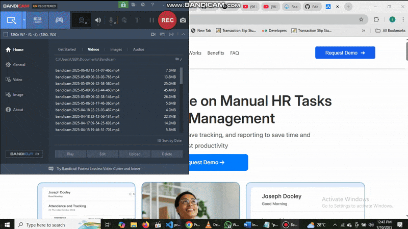
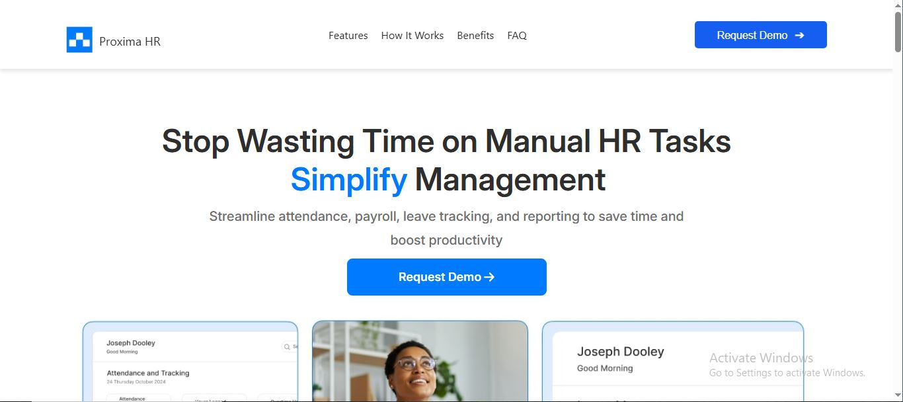
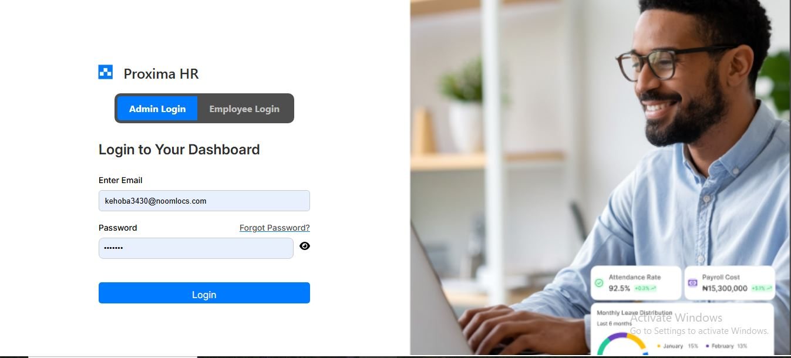
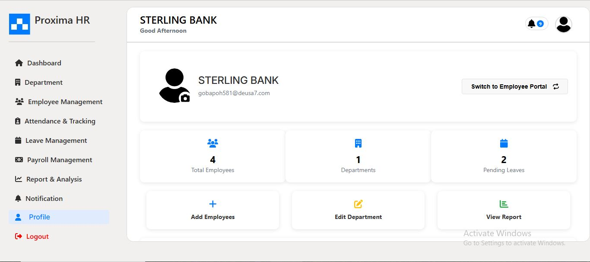
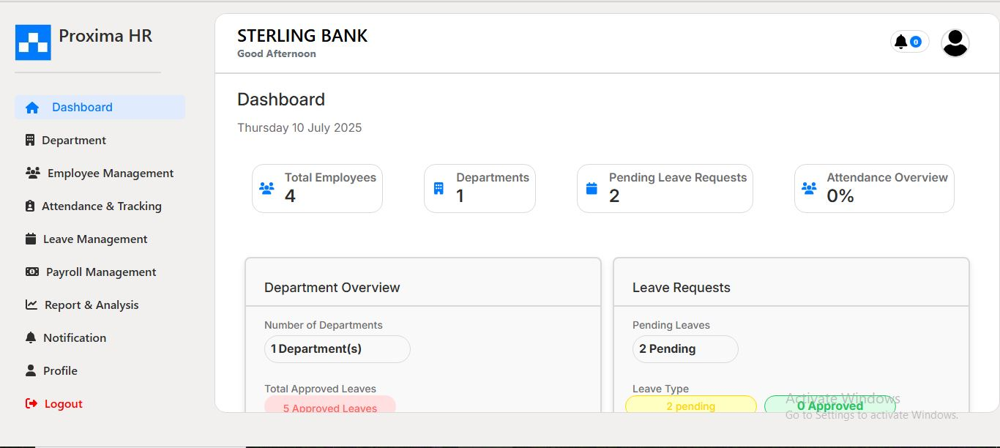
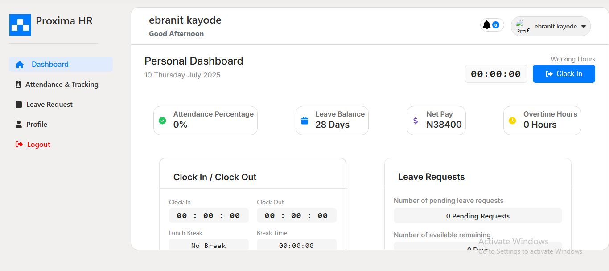
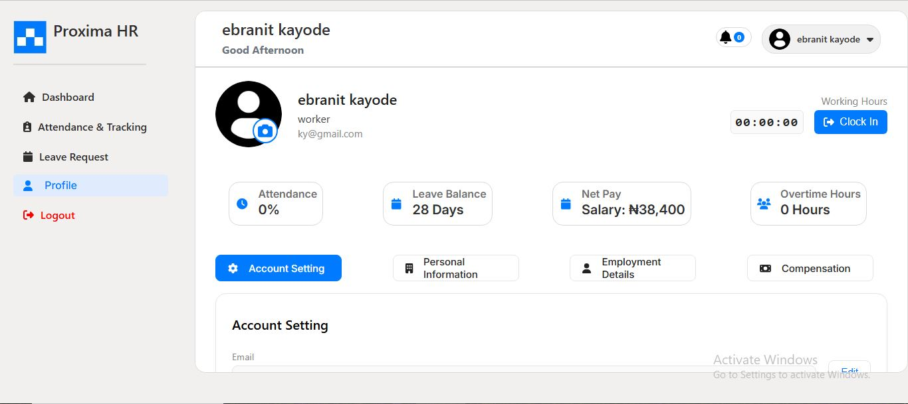

# Master HRM Project

A comprehensive full-stack web app for managing employee and employer roles within a company. This platform handles Payroll, Attendance, Leave management, and provides actionable HR analytics—all in one place.

---



## 🚀 Features

- **Employee & Employer Management:** Centralized records for all staff and roles.
- **Payroll Automation:** Salary calculations, deductions, and payslip generation.
- **Attendance Tracking:** Accurate clock-in/out, absence logs, and reporting.
- **Leave Management:** Easy request, approval, and tracking of employee leave.
- **Analytics Dashboard:** Visual HR metrics for smarter decisions.
- **Secure Authentication:** Protects company data with robust access controls.

---

## 🛠️ Tech Stack

- **Frontend:** React, Vite, JavaScript, HTML, CSS
- **Backend:** python, django
- **Other Tools:** Redux, Axios

---

## 📦 Installation & Setup

1. **Clone the repository:**
    ```bash
    git clone https://github.com/ajumobiisaac96/masterhrmproject.git
    cd masterhrmproject
    ```
2. **Install dependencies:**
    ```bash
    npm install
    ```
3. **Start the development server:**
    ```bash
    npm run dev
    ```
4. **Open your browser and visit** `http://localhost:5173` (or as indicated in your terminal).

---

## 💡 Usage

- Log in to access the dashboard and manage employees or employers.
- Use the sidebar to navigate Payroll, Attendance, Leave, and Reports.
- Explore analytics for actionable HR insights.

---

## 📸 Demo Screenshots

> Below are some screenshots and a demo GIF showing key sections of the HRM dashboard and user experience:

### App Walkthrough


### Auth Process


### HR Dashboard


### Personal Dashboard


### Profile Section



---

## 🤝 Contributing

Contributions are welcome! Please fork the repository and open a pull request with your changes. For major changes, open an issue first to discuss your proposal.

---

## 📄 License

This project is licensed under the MIT License.

---

## 🙋‍♂️ Contact

For feedback or questions, please reach out to [ajumobiisaac96](mailto:your-email@example.com).
